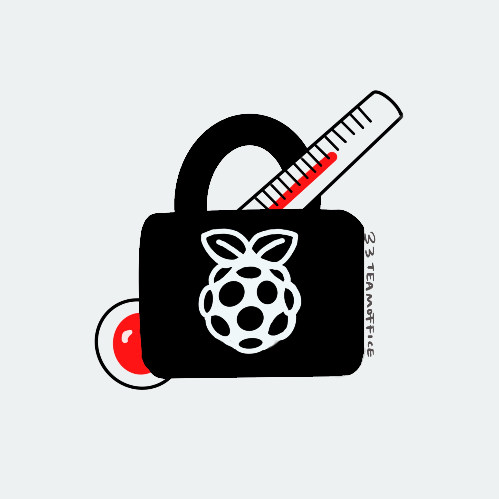

# Intelligent-Temperature-Door-Lock

  <a href="https://github.com/ShengzhanHuang/Intelligent-Temperature-Door-Lock"></img></a>

  

## ABOUT

This is a project designed to respond to Corona Virus Disease 2019. It is part of the real-time embedded programming course at the University of Glasgow. We try to complete an Intelligent Temperature Door Lock system, which can detect visitors' body temperature, record the temperature and photos of visitors, and realize remote unlocking.

## HARDWARE
- Raspberry Pi 4B
- 5MP Camera Module OV5647
- GY-906 MLX90614ESF Contactless Temperature Sensor Module Compatible
-  128*64 OLED

## Mode
#### mode: public state
+ **State description**: The system in the public state is usually applicable to public places such as laboratories and teaching buildings, shopping malls, supermarkets and other scenarios. The unlocking condition of the door lock system in this scenario is the only criterion for determining whether the temperature is normal, and the body temperature and photos of each visitor will be recorded, and the information will be returned to the administrator authority owner.
+ **working principle**
	+ **Precondition** : The door lock mode is public state, and the display on the door shows that the door lock status is OFF
	+ When visitors arrive, they press the temperature detection button to measure the temperature and take photos
	+ The data is packaged and sent to the administrator authority device for recording and backup, and the temperature sensing data is returned and displayed on the door screen
	+ If the visitor's body temperature is too high, the administrator's device will be marked with a red warning and the door will not be opened; if the visitor's body temperature is normal, he can press to open the door by himself after hearing the unlocking sound.

#### mode: private state
+ **State description**: The private state is usually applicable to private scenes such as home environment. The unlocking conditions of the door lock system in this scene mainly depend on the judgment of the administrator with authority. Information such as temperature and visitor photos will be transmitted to the administrator's device and determined by the administrator Whether to open the door, in this state, the administrator device has the highest authority to unlock.

+ **working principle**
	+ **Precondition**: The lock mode is private state, and the display on the door shows that the lock status is OFF
	+ When visitors arrive, they press the temperature detection button to measure the temperature and take photos
	+ The data is packaged and sent to the administrator authority device , and the temperature sensing data is displayed on the door screen
	+ If the visitor’s body temperature is too high, the administrator’s device will be warned in red;
	+ The administrator determines whether to open the door based on the visitor information

## Author
> Introduction Team 33 in ENG5220: Real Time Embedded Programming

👤 **Shengzhan Huang**

👤 **Yingqi Wang**

👤 **Fangyu Zhai**

This project is marketed on Twitter [@rtep33](https://twitter.com/home?lang=zh-cn) 
You can follow and contact us via Twitter

  <a href="https://twitter.com/home?lang=zh-cn"></img></a>

  

